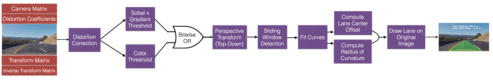

# Self-Driving Car Nanodegree
# Advanced Lane Detection with OpenCV

### Overview
On the first project of the Self-Driving Car Nanodegree we developed a rudimentary algorithm to detect lane lines on roads. This algorithm was only able to detect straight lines under constant lighting and road conditions. In addition, the algorithm was not able to extract valuable road information such as road curvature which we would need to steer the vehicle correctlty. A more robust algorithm is necessary to tackle these challenges. The objective of this project was to develop a more robust approach to tackle the following unresolved challenges from project one: 

1. Detecting lanes on roads that can accurately identify road curvature 
2. Detect lanes under varying lighting conditions (shadows, rapid changes of brightness, and pavement color)

### Included Files

This project was written in Python. The follwing files were used to create an test the model.

1. `Advanced Lane Finding - Oscar Argueta.ipynb`: Used to develop the lane detection algorithm. Detailed explanations and figures can be found in this jupyter notebook 
2. `camera_calibration.py`: Python script that calibrates camera using the images in the `camera_cal` directory. Generates the pickle file `dist_pickle.p` containing the camera matrix and distortion coefficients
3. `writeup.md`: Detailed report that includes detailed description of the code used in each step and You should image examples to demonstrate how the code works
4. `project_video.mp4`: Video stream to run the lane detection algorithm on
5. `result.mp4`: Output video with detected lane projected onto the road in the video stream

### Algorithm
The following are the steps to detect road lane lines robustly:

1. Compute the camera calibration matrix and distortion coefficients given a set of chessboard images.
2. Apply a distortion correction to raw images.
3. Use color transforms, gradients, etc., to create a thresholded binary image.
4. Apply a perspective transform to rectify binary image ("bird's-eye view").
5. Detect lane pixels and fit to find the lane boundary.
6. Determine the curvature of the lane and vehicle position with respect to center.
7. Warp the detected lane boundaries back onto the original image.
8. Output visual display of the lane boundaries and numerical estimation of lane curvature and vehicle position.

The diagram below summarizes the pipeline to process images.

## Results

## How to run

1. Install [anaconda](https://www.continuum.io/downloads)
2. Install and activate the [carnd-term1](https://github.com/udacity/CarND-Term1-Starter-Kit) conda environment
3. Run `$ python camera_calibration.py` to obtain distortion correction parameters in a pickle file called `dist_pickle.p`
4. Run ` $ jupyter notebook` on the directory containing the IPython notebook and open `Advanced Lane Detection - Oscar Argueta.ipynb`
